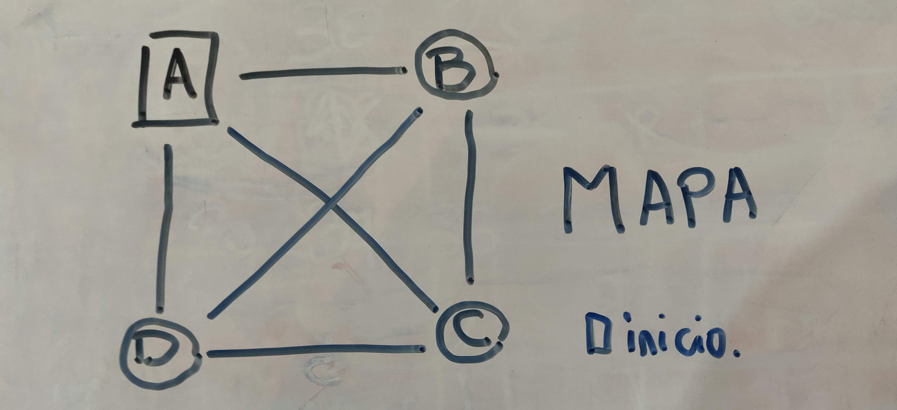
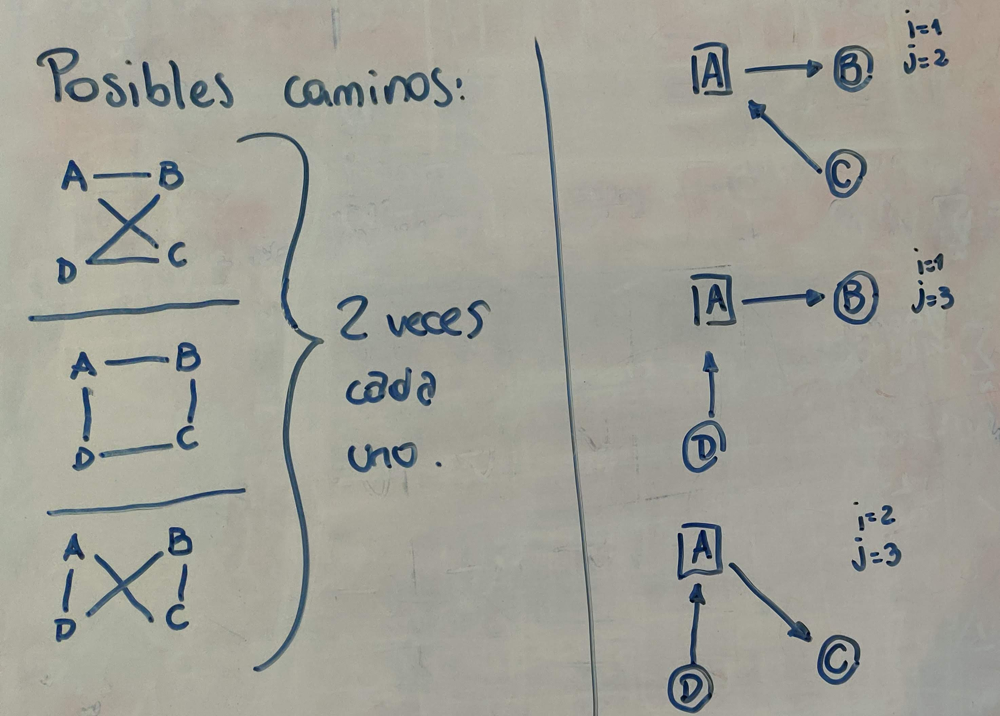

# Trabajo Final de Estructuras de Datos y Algoritmos

```c
typedef struct _MatrizCostos {
  int n;
  int* matriz;
  int* visitados;
} * MatrizCostos;
```
- n representa la cantidad de ciudades.
- Primero utilizo un solo arrlego de ```n * n```, donde n es la cantidad de ciudades, para disminuir el llamado de la función ```calloc()```. Luego para poder acceder a la posición ```[i][j]``` de la matriz utilizamos la expresión ```[(n * i) + j]```.
- Por último, utilizo un arreglo de n enteros, que usamos al momento de de buscar el camino de menor costo. Este arreglo es de 0 y 1. Si queremos ver si visitamos la ciudad k, usamos ```visitados[i]``` y si es 1, es que fue visitado, y 0 en el caso contrario.

### Resolución de Problema
Decidí resolver este problema usando fuerza bruta, con algunas optimizaciones.
La primera optimización fue fijar un orden al camino. Como podemos ver en la función ```resolver_mapa()```, lo que hago es fijar la primera ciudad que voy a visitar y tambien fijo la última ciudad que voy a visitar, realizando todas las permutuaciones posibles. De esta forma, al fijar un orden, reducimos la cantidad de llamadas a la función ```obtener_camino()```.
Ya como fijamos la primera función, lo que hago es llamar la función ```obtener_camino()``` con una profundidad 2.

###### Ejemplo:

Fijamos la primera y la última ciudad de la siguiente manera:
Las ciudades las representamos con n enteros, n la cantidad de ciudades (n = 4): a = 0, b = 1, c = 2, d = 3.
```c
for (int i = 1; i < n - 1; i++) {
    int costo = matriz->matriz[i];
    if (costo) {
      actual[1] = i;
      matriz->visitados[i] = 1;
      for (int j = i + 1; j < n; j++) {
        int _costo = matriz->matriz[(n * j)];
        if (_costo) {
          actual[n - 1] = j;
          actual[n] = (costo + _costo);
          matriz->visitados[j] = 1;
          obtener_camino(2, actual, minimo, matriz);
          matriz->visitados[j] = 0;
          actual[n] -= _costo;
        }
      }
      actual[n] -= costo;
      matriz->visitados[i] = 0;
    }
  }
```
El entero ```i``` representa la ciudad que visitamos primero y el entero ```j``` representa la última ciudad que vamos a visitar.
Luego nos queda de la siguente manera:


La segunda optimización es, al momento de recorrer un camino, si el ```costo_actual > costo_minimo```, dejamos de recorrer ese camino y pasamos al siguiente.

### MODO DE USO
Para compilar el programa utilizamos un Makefile:
```bash
make
./main [entrada.txt] [salida.txt]
```
El archivo [entrada.txt] debe tener el siguiente formato:
```txt
Ciudades
ciudad_1, ciudad_2, ..., ciudad_n
Costos
ciudad_1,ciudad_2,costo_1
ciudad_1,ciudad_3,costo_2
...
ciudad_i,ciudad_k,costo_s (donde i,k <= n && i != k) (los costo_ < 0)
```
El mapa que se encuentra en el archivo ```[entrada.txt]``` debe tener un mapa el cual tenga solución, es decir, que sea cerrado con ```n >= 3```.

Luego de obtener el costo mínimo, se crea o edita el archivo [salida.txt]
El archivo [salida.txt] va a tener el camino en el siguiente formato:
```txt
Costo: costo_minimo
ciudad_1,ciudad_2,costo_1
ciudad_2,ciudad_i,costo_s
...
ciudad_k,ciudad_1,costo_r
```
